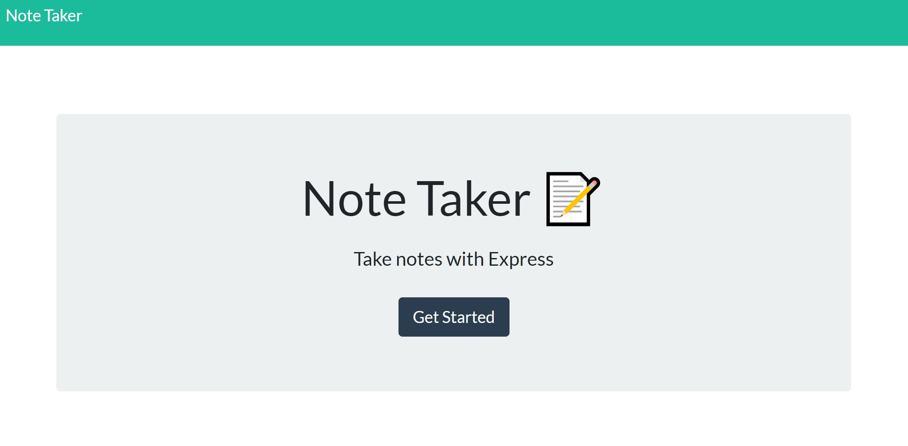
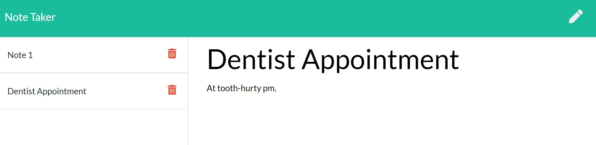

<!-- @format -->

# note-taker

An app to write, save and delete notes using an Express backend.

## User Story

Given a frontend consisting of 2 html files and associated css and javascript files, the requirement was to provide backend functionality to allow a user to create, view and store notes using the Express framework with Nodejs.

Additional functionality has been added to allow the user to update existing notes.

## Built With

- [VScode](https://code.visualstudio.com/) - The editor of choice

#### Initial interface

### Licence

GNU General Public License v3.0

### Link to app on Heroku

<a href="https://mysterious-hollows-82662.herokuapp.com/">Note Taker</a>

### Link to the github Repo

<a href="https://github.com/galluk/note-taker">Note Taker</a>

## Author

- **Luke Gallagher** -
  luke.gallagher.cst@gmail.com
